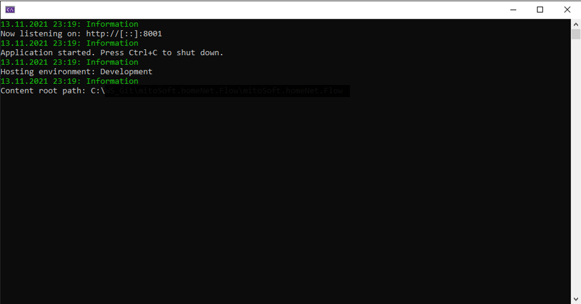

# mitoSoft.Razor.Logging
A Razor library push logevents of a Blazor App to the console output.
The output is colored to distinguish the timestamps from the log messages like



## Dependencies

Microsoft.Extensions.Logging (Version 6.0.0)
Microsoft.AspNetCore.Components.Web (Version 5.0.12)


## Example usage in a Blazor component

```c#
@page "/logs"

@using mitoSoft.Razor.Logging
@using mitoSoft.Razor.Logging.Extensions

<h3>Logs</h3>

<p>
    <select @bind="@Mode">
        <option>HostingLogger</option>
        <option>SomeClassLogger</option>
    </select>
</p>

@if (Mode == "HostingLogger")
{
    <LoggingTextarea Loggers="this.GetHostingLoggers()" />
}
else if (Mode == "SomeClassLogger")
{
    <LoggingTextarea Loggers="this.GetLogger2()" />
}

@code {
    [Parameter]
    public string Mode { set; get; }

    private List<ConsoleLogger> GetHostingLoggers()
    {
        return new List<ConsoleLogger>
        {			
            Program.Host.Services.GetConsoleLogger("Microsoft.Hosting.Lifetime"),
        };
    }

    private List<ConsoleLogger> GetLogger2()
    {
        return new List<ConsoleLogger>
        {
            Program.Host.Services.GetConsoleLogger("mitoSoft.Razor.Logging.Example.Someclass"),
        };
    }
}
  
```

with service setup

```c#
using Microsoft.AspNetCore.Hosting;
using Microsoft.Extensions.DependencyInjection;
using Microsoft.Extensions.Hosting;
using Microsoft.Extensions.Logging;
using System;
using mitoSoft.Razor.Logging.Extensions;

namespace mitoSoft.Razor.Logging.Example
{
    public class Program
    {
        public static IHost Host { get; private set; }

        public static void Main(string[] args)
        {
            Program.Host = CreateHostBuilder(args).Build();

            _ = Program.Host.Services.GetRequiredService<ILogger<SomeClass>>(); //logger for a arbitrary class

            Program.Host.Run();
        }

        public static IHostBuilder CreateHostBuilder(string[] args) =>
            Microsoft.Extensions.Hosting.Host.CreateDefaultBuilder(args)
                .ConfigureLogging(builder =>
                    builder.ClearProviders()
                           .AddConsoleLogger())
                .ConfigureWebHostDefaults(webBuilder =>
                {
                    webBuilder.UseStartup<Startup>();
                    webBuilder.UseUrls("http://*:8001/");
                });
    }
}  
```

and the example class 

```c#
namespace mitoSoft.Razor.Logging.Example
{
	public class SomeClass
	{
		...
	}
}
```

